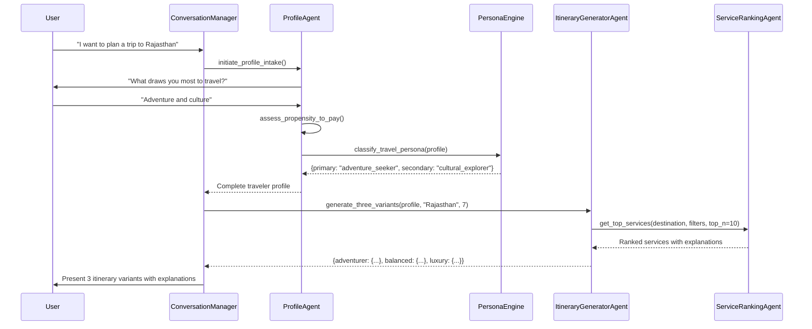
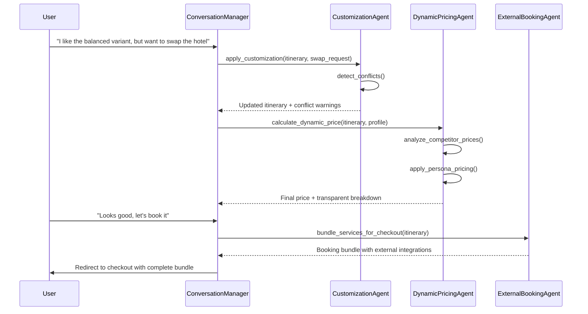

# Travello.ai - Advanced AI Travel Concierge Technical Documentation
## Updated Architecture Based on Enhanced PRD

---

## Table of Contents
1. [Enhanced System Vision](#enhanced-system-vision)
2. [Updated High Level Design (HLD)](#updated-high-level-design-hld)
3. [Advanced Low Level Design (LLD)](#advanced-low-level-design-lld)
4. [Multi-Agent System Architecture v2.0](#multi-agent-system-architecture-v20)
5. [Customer Journey Implementation](#customer-journey-implementation)
6. [Agent Communication Protocols](#agent-communication-protocols)
7. [Implementation Roadmap](#implementation-roadmap)

---

## Enhanced System Vision

### 1. Core Purpose
Travello.ai transforms from a conversational travel planner into a **comprehensive AI travel concierge** that replaces traditional OTA friction with intelligent, hyper-personalized trip planning, customization, and dynamic pricing.

### 2. Key Differentiators

#### Traditional OTA Problems Solved
- ❌ **Manual Trip Assembly**: Customers must piece together flights, hotels, activities
- ❌ **Generic Recommendations**: One-size-fits-all suggestions
- ❌ **Static Pricing**: Fixed rates regardless of market conditions
- ❌ **Overwhelming Choice**: Too many options without guidance

#### Travello.ai Solutions
- ✅ **AI Concierge**: Automated trip planning with human-like consultation
- ✅ **Hyper-Personalization**: Travel personas with behavioral insights
- ✅ **Dynamic Pricing**: Real-time market-aware pricing with competitor analysis
- ✅ **Intelligent Curation**: Top-N recommendations with explainable reasoning

---

## Updated High Level Design (HLD)

### 1. Enhanced System Architecture

```
┌─────────────────────────────────────────────────────────────────┐
│                    TRAVELLO.AI ECOSYSTEM                        │
├─────────────────────────────────────────────────────────────────┤
│  Frontend Layer                                                 │
│  ├── Conversational UI (Profile Intake)                        │
│  ├── Itinerary Builder (3 Variants + Customization)            │
│  ├── Service Selector (Top-N with Switch & Search)             │
│  └── Dynamic Pricing Display (Transparent Breakdown)           │
├─────────────────────────────────────────────────────────────────┤
│  AI Concierge Layer (Enhanced Multi-Agent System)              │
│  ├── ProfileAgent (Persona + Propensity Assessment)            │
│  ├── PersonaEngine (Classification & Matching)                 │
│  ├── ItineraryGeneratorAgent (3 Variants Generation)           │
│  ├── ServiceRankingAgent (Top-N Selection + Explainability)    │
│  ├── CustomizationAgent (Editability + Conflict Resolution)    │
│  ├── PersonalizationAgent (Seasonality + Sustainability)       │
│  ├── DynamicPricingAgent (Market-Aware Pricing)                │
│  ├── ExternalBookingAgent (3rd Party Integration)              │
│  └── ConfigurationAgent (Business Rules Management)            │
├─────────────────────────────────────────────────────────────────┤
│  Data & Integration Layer                                       │
│  ├── OTA Database (Flights, Hotels, Cabs)                      │
│  ├── External Sightseeing APIs                                 │
│  ├── Competitor Pricing Feeds                                  │
│  ├── Real-time Market Data                                     │
│  ├── Sustainability Database                                   │
│  └── Seasonality & Events Calendar                             │
├─────────────────────────────────────────────────────────────────┤
│  Business Intelligence Layer                                    │
│  ├── Persona Analytics                                         │
│  ├── Pricing Optimization                                      │
│  ├── Conversion Tracking                                       │
│  └── Performance Monitoring                                    │
└─────────────────────────────────────────────────────────────────┘
```

### 2. Customer Journey Phases Implementation

#### Phase 1: Discover (Profile Intake → Draft Itinerary)
```
Profile Questions → Persona Classification → Propensity Assessment
         ↓
Draft Itinerary Generation (3 Variants) → Service Ranking → Top-N Selection
```

#### Phase 2: Decide (Customization → Dynamic Pricing → Checkout)
```
Service Swapping ← → Customization Engine → Conflict Detection
         ↓
Dynamic Pricing Calculation → Competitor Analysis → Transparent Breakdown
         ↓
Booking Bundle Creation → Checkout Hand-off
```

#### Phase 3: Update (Future Scope)
```
Change Requests → Impact Analysis → Re-pricing → Confirmation
```

### 3. Technology Stack Enhancement

#### AI & Machine Learning
- **Persona Classification**: ML models for travel behavior analysis
- **Dynamic Pricing**: Real-time pricing algorithms
- **Recommendation Engine**: Advanced ranking with multiple factors
- **Sentiment Analysis**: User satisfaction and preference evolution

#### External Integrations
- **Competitor APIs**: Real-time pricing data
- **Weather Services**: Seasonal planning optimization
- **Sustainability APIs**: Carbon footprint and eco-certifications
- **External Booking**: Third-party activity providers

#### Business Intelligence
- **Analytics Engine**: User behavior and conversion tracking
- **A/B Testing**: Persona algorithm optimization
- **Revenue Management**: Dynamic pricing performance

---

## Advanced Low Level Design (LLD)

### 1. Enhanced Agent Architecture

#### 1.1 ProfileAgent (Persona & Propensity Assessment)

**Role**: Comprehensive user profiling through conversational intake

**Core Capabilities**:
```python
class ProfileAgent:
    async def conduct_profile_intake(self, session_id: str) -> dict:
        # Conversational questions about travel style, budget, preferences
        # Returns comprehensive traveler profile
        
    async def assess_propensity_to_pay(self, profile: dict) -> dict:
        # Analyze willingness to spend on upgrades
        # Returns propensity scoring and spending patterns
        
    async def classify_travel_persona(self, profile: dict) -> str:
        # Map profile to travel personas
        # Returns: adventure_seeker, cultural_explorer, luxury_connoisseur, etc.
```

**Profile Data Structure**:
```python
class TravelerProfile:
    # Basic Information
    trip_style: List[str]  # ["adventure", "culture", "relaxation"]
    budget_range: dict     # {"min": 50000, "max": 150000, "currency": "INR"}
    pace_preference: str   # "slow", "balanced", "packed"
    group_composition: dict # {"type": "family", "adults": 2, "children": 1}
    
    # Preferences
    food_preferences: List[str]  # ["vegetarian", "local_cuisine", "fine_dining"]
    accessibility_needs: List[str]
    sustainability_priority: float  # 0.0-1.0 importance score
    
    # Behavioral Insights
    propensity_to_pay: dict
    # {
    #   "base_budget": 100000,
    #   "upgrade_willingness": 0.7,
    #   "premium_threshold": 150000,
    #   "discount_sensitivity": 0.3
    # }
    
    # Persona Classification
    primary_persona: str    # "adventure_seeker"
    secondary_persona: str  # "cultural_explorer"
    persona_confidence: float
```

**LLM Prompting Strategy**:
```python
def generate_profile_questions(self, context: dict) -> List[str]:
    return [
        "What draws you most to travel? (Adventure, culture, relaxation, or something else?)",
        "How do you prefer to experience a destination? (Packed with activities or leisurely exploration?)",
        "When you think about splurging on a trip, what matters most? (Accommodation, experiences, dining, or transportation?)",
        "How important is sustainability in your travel choices? (Very important, somewhat, or not a priority?)"
    ]
```

#### 1.2 PersonaEngine (Advanced Classification & Matching)

**Role**: Sophisticated persona classification with behavioral pattern recognition

**Persona Definitions**:
```python
TRAVEL_PERSONAS = {
    "adventure_seeker": {
        "characteristics": {
            "activity_preference": ["hiking", "rafting", "paragliding", "scuba_diving"],
            "accommodation_style": ["adventure_camps", "eco_lodges", "budget_hotels"],
            "budget_allocation": {"activities": 0.4, "accommodation": 0.2, "transport": 0.4},
            "pace": "packed",
            "risk_tolerance": "high"
        },
        "spending_patterns": {
            "base_budget_multiplier": 1.0,
            "activity_premium": 1.5,
            "accommodation_premium": 0.8,
            "upgrade_likelihood": 0.6
        }
    },
    
    "cultural_explorer": {
        "characteristics": {
            "activity_preference": ["museums", "heritage_sites", "local_tours", "cooking_classes"],
            "accommodation_style": ["heritage_hotels", "boutique_stays", "homestays"],
            "budget_allocation": {"activities": 0.3, "accommodation": 0.3, "transport": 0.4},
            "pace": "balanced",
            "authenticity_preference": "high"
        },
        "spending_patterns": {
            "base_budget_multiplier": 1.1,
            "cultural_premium": 1.3,
            "local_experience_premium": 1.4,
            "upgrade_likelihood": 0.7
        }
    },
    
    "luxury_connoisseur": {
        "characteristics": {
            "activity_preference": ["spa", "fine_dining", "private_tours", "exclusive_experiences"],
            "accommodation_style": ["luxury_resorts", "5_star_hotels", "premium_villas"],
            "budget_allocation": {"activities": 0.2, "accommodation": 0.5, "transport": 0.3},
            "pace": "slow",
            "service_expectation": "premium"
        },
        "spending_patterns": {
            "base_budget_multiplier": 2.0,
            "luxury_premium": 1.8,
            "service_premium": 1.6,
            "upgrade_likelihood": 0.9
        }
    },
    
    "budget_backpacker": {
        "characteristics": {
            "activity_preference": ["free_walking_tours", "street_food", "public_transport", "hostels"],
            "accommodation_style": ["hostels", "budget_hotels", "shared_accommodations"],
            "budget_allocation": {"activities": 0.3, "accommodation": 0.2, "transport": 0.5},
            "pace": "flexible",
            "value_priority": "high"
        },
        "spending_patterns": {
            "base_budget_multiplier": 0.6,
            "value_premium": 0.8,
            "discount_sensitivity": 0.9,
            "upgrade_likelihood": 0.2
        }
    },
    
    "eco_conscious_traveler": {
        "characteristics": {
            "activity_preference": ["nature_walks", "wildlife_sanctuaries", "sustainable_tours", "organic_farms"],
            "accommodation_style": ["eco_resorts", "sustainable_hotels", "green_certified"],
            "budget_allocation": {"activities": 0.35, "accommodation": 0.35, "transport": 0.3},
            "carbon_priority": "high",
            "local_support": "high"
        },
        "spending_patterns": {
            "base_budget_multiplier": 1.2,
            "sustainability_premium": 1.4,
            "local_premium": 1.3,
            "upgrade_likelihood": 0.8
        }
    }
}
```

**Persona Matching Algorithm**:
```python
async def classify_persona(self, profile: TravelerProfile) -> dict:
    scores = {}
    
    for persona_name, persona_data in TRAVEL_PERSONAS.items():
        score = 0.0
        
        # Activity preference matching (30% weight)
        activity_score = self._calculate_activity_match(
            profile.preferences, 
            persona_data["characteristics"]["activity_preference"]
        )
        score += activity_score * 0.3
        
        # Budget allocation matching (25% weight)
        budget_score = self._calculate_budget_match(
            profile.budget_allocation,
            persona_data["characteristics"]["budget_allocation"]
        )
        score += budget_score * 0.25
        
        # Pace preference matching (20% weight)
        pace_score = 1.0 if profile.pace_preference == persona_data["characteristics"]["pace"] else 0.5
        score += pace_score * 0.2
        
        # Sustainability alignment (15% weight)
        sustainability_score = self._calculate_sustainability_match(profile, persona_data)
        score += sustainability_score * 0.15
        
        # Group composition fit (10% weight)
        group_score = self._calculate_group_fit(profile.group_composition, persona_data)
        score += group_score * 0.1
        
        scores[persona_name] = score
    
    # Return top 2 personas with confidence scores
    sorted_personas = sorted(scores.items(), key=lambda x: x[1], reverse=True)
    
    return {
        "primary_persona": sorted_personas[0][0],
        "primary_confidence": sorted_personas[0][1],
        "secondary_persona": sorted_personas[1][0] if len(sorted_personas) > 1 else None,
        "secondary_confidence": sorted_personas[1][1] if len(sorted_personas) > 1 else 0,
        "all_scores": scores
    }
```

#### 1.3 ItineraryGeneratorAgent (3-Variant Generation)

**Role**: Generate three distinct itinerary variants based on persona insights

**Variant Generation Strategy**:
```python
class ItineraryGeneratorAgent:
    async def generate_three_variants(self, profile: TravelerProfile, destination: str, duration: int) -> dict:
        variants = {}
        
        # Adventurer Variant - Activity-dense, thrill-seeking
        variants["adventurer"] = await self._generate_adventurer_variant(profile, destination, duration)
        
        # Balanced Variant - Mix of attractions and downtime
        variants["balanced"] = await self._generate_balanced_variant(profile, destination, duration)
        
        # Luxury Variant - Premium experiences and accommodations
        variants["luxury"] = await self._generate_luxury_variant(profile, destination, duration)
        
        return variants
    
    async def _generate_adventurer_variant(self, profile, destination, duration):
        return {
            "variant_type": "adventurer",
            "description": "Action-packed itinerary with maximum adventure activities",
            "activity_density": "high",  # 4-6 activities per day
            "accommodation_style": "adventure_focused",
            "budget_allocation": {
                "activities": 0.45,      # Higher activity spend
                "accommodation": 0.25,   # Moderate accommodation
                "transport": 0.30        # Standard transport
            },
            "daily_schedule": await self._create_adventure_schedule(destination, duration),
            "recommended_services": await self._select_adventure_services(destination, profile)
        }
```

**Service Selection for Each Variant**:
```python
async def _select_adventure_services(self, destination: str, profile: TravelerProfile) -> dict:
    # Query services with adventure-specific filters
    services = await self.service_ranking_agent.get_top_services(
        destination=destination,
        service_types=["activities", "accommodation", "transport"],
        filters={
            "activity_types": ["adventure_sports", "outdoor_activities", "thrill_experiences"],
            "accommodation_types": ["adventure_camps", "eco_lodges", "activity_focused_hotels"],
            "price_range": self._calculate_adventure_budget_range(profile),
            "persona_match": "adventure_seeker"
        },
        top_n=10
    )
    
    return services
```

#### 1.4 ServiceRankingAgent (Top-N Selection with Explainability)

**Role**: Intelligent service ranking with transparent reasoning

**Ranking Algorithm**:
```python
class ServiceRankingAgent:
    def __init__(self):
        self.ranking_weights = {
            "persona_fit": 0.25,        # How well service matches persona
            "price_value": 0.20,        # Price vs. value proposition
            "location_convenience": 0.15, # Proximity to other activities
            "sustainability_score": 0.10, # Eco-friendliness rating
            "seasonality_fit": 0.10,    # Weather/season appropriateness
            "user_ratings": 0.10,       # Reviews and ratings
            "availability": 0.05,       # Real-time availability
            "uniqueness": 0.05          # Distinctive experiences
        }
    
    async def rank_services(self, services: List[dict], profile: TravelerProfile, context: dict) -> List[dict]:
        ranked_services = []
        
        for service in services:
            score = 0.0
            explanations = []
            
            # Persona fit scoring
            persona_score = self._calculate_persona_fit(service, profile.primary_persona)
            score += persona_score * self.ranking_weights["persona_fit"]
            if persona_score > 0.7:
                explanations.append(f"Perfect match for {profile.primary_persona} travelers")
            
            # Price-value analysis
            price_score = self._calculate_price_value(service, profile.propensity_to_pay)
            score += price_score * self.ranking_weights["price_value"]
            if price_score > 0.8:
                explanations.append("Excellent value for money")
            elif price_score < 0.3:
                explanations.append("Premium pricing for luxury experience")
            
            # Location convenience
            location_score = self._calculate_location_convenience(service, context.get("itinerary", []))
            score += location_score * self.ranking_weights["location_convenience"]
            if location_score > 0.8:
                explanations.append("Conveniently located near other planned activities")
            
            # Sustainability scoring
            if profile.sustainability_priority > 0.5:
                sustainability_score = self._calculate_sustainability_score(service)
                score += sustainability_score * self.ranking_weights["sustainability_score"]
                if sustainability_score > 0.7:
                    explanations.append("Eco-certified with low carbon footprint")
            
            # Seasonality appropriateness
            seasonality_score = self._calculate_seasonality_fit(service, context.get("travel_dates"))
            score += seasonality_score * self.ranking_weights["seasonality_fit"]
            if seasonality_score > 0.8:
                explanations.append("Perfect timing for this experience")
            
            service["ranking_score"] = score
            service["explanations"] = explanations
            service["why_recommended"] = self._generate_recommendation_reason(service, profile, explanations)
            
            ranked_services.append(service)
        
        # Sort by score and return top N
        ranked_services.sort(key=lambda x: x["ranking_score"], reverse=True)
        return ranked_services[:10]  # Top 10 services
```

**Explainability Generation**:
```python
def _generate_recommendation_reason(self, service: dict, profile: TravelerProfile, explanations: List[str]) -> str:
    reasons = []
    
    # Primary reason based on highest scoring factor
    if service["ranking_score"] > 0.8:
        primary_reason = "Highly recommended"
    elif service["ranking_score"] > 0.6:
        primary_reason = "Great choice"
    else:
        primary_reason = "Good option"
    
    # Combine explanations into coherent reason
    if explanations:
        detailed_reason = f"{primary_reason}: " + ", ".join(explanations[:2])
    else:
        detailed_reason = f"{primary_reason} for your travel style"
    
    return detailed_reason
```

#### 1.5 CustomizationAgent (Full Editability & Conflict Resolution)

**Role**: Handle comprehensive itinerary customization with intelligent conflict detection

**Customization Capabilities**:
```python
class CustomizationAgent:
    async def apply_customization(self, itinerary: dict, customization_request: dict) -> dict:
        """Handle various customization requests"""
        
        if customization_request["type"] == "reorder_days":
            return await self._reorder_days(itinerary, customization_request["params"])
        elif customization_request["type"] == "add_destination":
            return await self._add_destination(itinerary, customization_request["params"])
        elif customization_request["type"] == "move_activity":
            return await self._move_activity(itinerary, customization_request["params"])
        elif customization_request["type"] == "lock_service":
            return await self._lock_service(itinerary, customization_request["params"])
        elif customization_request["type"] == "swap_service":
            return await self._swap_service(itinerary, customization_request["params"])
    
    async def detect_conflicts(self, itinerary: dict) -> List[dict]:
        """Detect and report itinerary conflicts"""
        conflicts = []
        
        for day in itinerary["days"]:
            # Check for timing conflicts
            timing_conflicts = self._check_timing_conflicts(day)
            conflicts.extend(timing_conflicts)
            
            # Check travel time feasibility
            travel_conflicts = self._check_travel_feasibility(day)
            conflicts.extend(travel_conflicts)
            
            # Check activity compatibility
            compatibility_conflicts = self._check_activity_compatibility(day)
            conflicts.extend(compatibility_conflicts)
        
        return conflicts
    
    def _check_timing_conflicts(self, day: dict) -> List[dict]:
        """Check for overlapping activities or insufficient time"""
        conflicts = []
        activities = sorted(day["activities"], key=lambda x: x["start_time"])
        
        for i in range(len(activities) - 1):
            current_activity = activities[i]
            next_activity = activities[i + 1]
            
            current_end = self._calculate_end_time(current_activity)
            next_start = next_activity["start_time"]
            
            # Check for overlap
            if current_end > next_start:
                conflicts.append({
                    "type": "timing_overlap",
                    "severity": "high",
                    "description": f"{current_activity['name']} overlaps with {next_activity['name']}",
                    "suggestion": f"Reschedule {next_activity['name']} to start at {current_end}"
                })
            
            # Check for insufficient travel time
            travel_time = self._estimate_travel_time(current_activity["location"], next_activity["location"])
            available_time = (next_start - current_end).total_seconds() / 60  # minutes
            
            if travel_time > available_time:
                conflicts.append({
                    "type": "insufficient_travel_time",
                    "severity": "medium",
                    "description": f"Not enough time to travel from {current_activity['name']} to {next_activity['name']}",
                    "suggestion": f"Allow at least {travel_time} minutes between activities"
                })
        
        return conflicts
```

#### 1.6 DynamicPricingAgent (Market-Aware Pricing)

**Role**: Real-time pricing with competitor analysis and profile-based optimization

**Dynamic Pricing Algorithm**:
```python
class DynamicPricingAgent:
    def __init__(self):
        self.pricing_factors = {
            "base_cost": 0.40,          # Actual service costs
            "market_demand": 0.20,      # Supply/demand dynamics
            "competitor_rates": 0.15,   # Competitive positioning
            "persona_premium": 0.10,    # Profile-based pricing
            "seasonality": 0.08,        # Seasonal adjustments
            "loyalty_discount": 0.04,   # Customer loyalty tier
            "sustainability_premium": 0.03  # Eco-friendly surcharge
        }
    
    async def calculate_dynamic_price(self, itinerary: dict, profile: TravelerProfile) -> dict:
        """Calculate final price with transparent breakdown"""
        
        # Base cost calculation
        base_cost = self._calculate_base_cost(itinerary)
        
        # Market demand adjustment
        demand_multiplier = await self._get_market_demand_multiplier(itinerary)
        demand_adjustment = base_cost * (demand_multiplier - 1.0) * self.pricing_factors["market_demand"]
        
        # Competitor pricing analysis
        competitor_adjustment = await self._calculate_competitor_adjustment(itinerary, profile)
        
        # Persona-based pricing
        persona_adjustment = self._calculate_persona_premium(base_cost, profile)
        
        # Seasonal pricing
        seasonal_adjustment = self._calculate_seasonal_adjustment(itinerary)
        
        # Loyalty discount
        loyalty_discount = self._calculate_loyalty_discount(base_cost, profile)
        
        # Sustainability premium
        sustainability_premium = self._calculate_sustainability_premium(itinerary, profile)
        
        # Final price calculation
        final_price = (base_cost + 
                      demand_adjustment + 
                      competitor_adjustment + 
                      persona_adjustment + 
                      seasonal_adjustment - 
                      loyalty_discount + 
                      sustainability_premium)
        
        return {
            "final_price": final_price,
            "base_cost": base_cost,
            "adjustments": {
                "market_demand": demand_adjustment,
                "competitor_positioning": competitor_adjustment,
                "persona_premium": persona_adjustment,
                "seasonal_adjustment": seasonal_adjustment,
                "loyalty_discount": -loyalty_discount,
                "sustainability_premium": sustainability_premium
            },
            "savings_message": self._generate_savings_message(base_cost, final_price, profile),
            "price_justification": self._generate_price_justification(itinerary, profile)
        }
    
    async def _get_market_demand_multiplier(self, itinerary: dict) -> float:
        """Get real-time demand multiplier for services"""
        # Simulate real-time market data
        # In production, this would call external APIs
        destination = itinerary["destination"]
        travel_dates = itinerary["dates"]
        
        # Factors affecting demand:
        # - Peak season vs off-season
        # - Local events and festivals
        # - Weather conditions
        # - Booking lead time
        
        base_multiplier = 1.0
        
        # Peak season adjustment
        if self._is_peak_season(destination, travel_dates):
            base_multiplier += 0.15
        
        # Event-based demand
        local_events = await self._check_local_events(destination, travel_dates)
        if local_events:
            base_multiplier += 0.1 * len(local_events)
        
        # Booking lead time (shorter lead time = higher demand)
        lead_time_days = self._calculate_lead_time(travel_dates)
        if lead_time_days < 14:
            base_multiplier += 0.05
        elif lead_time_days > 60:
            base_multiplier -= 0.03
        
        return min(1.5, max(0.8, base_multiplier))  # Cap between 0.8x and 1.5x
```

**Competitor Analysis**:
```python
async def _calculate_competitor_adjustment(self, itinerary: dict, profile: TravelerProfile) -> float:
    """Analyze competitor pricing and adjust to stay competitive"""
    
    # Get comparable packages from competitors
    competitor_prices = await self._fetch_competitor_prices(itinerary)
    
    if not competitor_prices:
        return 0.0
    
    our_base_price = self._calculate_base_cost(itinerary)
    avg_competitor_price = sum(competitor_prices) / len(competitor_prices)
    min_competitor_price = min(competitor_prices)
    
    # Competitive positioning strategy based on persona
    if profile.primary_persona == "budget_backpacker":
        # Target 5-10% below minimum competitor price
        target_price = min_competitor_price * 0.95
        adjustment = target_price - our_base_price
    elif profile.primary_persona == "luxury_connoisseur":
        # Premium positioning - can be 10-15% above average
        target_price = avg_competitor_price * 1.10
        adjustment = target_price - our_base_price
    else:
        # Balanced positioning - match average competitor price
        target_price = avg_competitor_price
        adjustment = target_price - our_base_price
    
    # Limit adjustment to reasonable bounds
    max_adjustment = our_base_price * 0.15  # Max 15% adjustment
    return max(-max_adjustment, min(max_adjustment, adjustment))
```

---

## Multi-Agent System Architecture v2.0

### 1. Enhanced Agent Ecosystem

```
┌─────────────────────────────────────────────────────────────────┐
│                TRAVELLO.AI AGENT ORCHESTRATION                  │
└─────────────────────────────────────────────────────────────────┘
                                    │
                                    ▼
┌─────────────────────────────────────────────────────────────────┐
│                 CONVERSATION MANAGER v2.0                      │
│              (Enhanced Orchestration Layer)                    │
└─────────────────────┬───────────────────────────────────────────┘
                      │
          ┌───────────┼───────────┐
          ▼           ▼           ▼
    ┌─────────┐ ┌─────────┐ ┌─────────┐
    │ PROFILE │ │ PERSONA │ │ ITINERY │
    │ AGENT   │ │ ENGINE  │ │ GENERAT │
    └─────────┘ └─────────┘ └─────────┘
          │           │           │
          └───────────┼───────────┘
                      ▼
    ┌─────────────────────────────────────────┐
    │         SERVICE RANKING AGENT           │
    │     (Top-N Selection + Explainability)  │
    └─────────────────┬───────────────────────┘
                      │
        ┌─────────────┼─────────────┐
        ▼             ▼             ▼
  ┌─────────┐   ┌─────────┐   ┌─────────┐
  │CUSTOMIZ │   │PERSONAL │   │DYNAMIC  │
  │ATION    │   │IZATION  │   │PRICING  │
  │AGENT    │   │AGENT    │   │AGENT    │
  └─────────┘   └─────────┘   └─────────┘
        │             │             │
        └─────────────┼─────────────┘
                      ▼
    ┌─────────────────────────────────────────┐
    │          EXTERNAL BOOKING AGENT         │
    │        (3rd Party Integration)          │
    └─────────────────┬───────────────────────┘
                      │
                      ▼
    ┌─────────────────────────────────────────┐
    │         CONFIGURATION AGENT             │
    │       (Business Rules Management)       │
    └─────────────────────────────────────────┘
```

### 2. Agent Interaction Protocols

#### 2.1 Discover Phase Flow



#### 2.2 Decide Phase Flow



### 3. Data Flow Architecture

#### 3.1 Profile Data Pipeline

```
User Input → Profile Agent → Persona Engine → Service Ranking
     ↓             ↓              ↓              ↓
Preferences → Propensity → Classification → Personalized
Collection   Assessment   Confidence     Recommendations
```

#### 3.2 Pricing Data Pipeline

```
Base Costs → Market Data → Competitor → Persona → Final Price
     ↓           ↓          Analysis     Premium      ↓
OTA Database → Real-time → API Feeds → Profile → Transparent
              Demand                   Based     Breakdown
```

---

## Customer Journey Implementation

### 1. Discover Phase Implementation

#### 1.1 Profile Intake Conversation Flow

```python
class ProfileIntakeOrchestrator:
    def __init__(self):
        self.conversation_stages = [
            "greeting_and_destination",
            "travel_style_assessment", 
            "budget_exploration",
            "preferences_deep_dive",
            "propensity_evaluation",
            "persona_confirmation"
        ]
    
    async def conduct_intake_conversation(self, session_id: str) -> dict:
        profile = TravelerProfile()
        
        for stage in self.conversation_stages:
            stage_handler = getattr(self, f"_handle_{stage}")
            stage_result = await stage_handler(session_id, profile)
            profile = self._update_profile(profile, stage_result)
            
            # Real-time persona prediction after each stage
            interim_persona = await self.persona_engine.predict_persona(profile)
            profile.interim_persona = interim_persona
        
        # Final persona classification
        final_persona = await self.persona_engine.classify_persona(profile)
        profile.primary_persona = final_persona["primary_persona"]
        profile.persona_confidence = final_persona["primary_confidence"]
        
        return profile
```

#### 1.2 Intelligent Question Adaptation

```python
async def _handle_travel_style_assessment(self, session_id: str, profile: TravelerProfile) -> dict:
    # Adapt questions based on destination mentioned
    if profile.destination:
        destination_context = await self.destination_agent.get_context(profile.destination)
        questions = self._generate_contextual_questions(destination_context)
    else:
        questions = self._generate_generic_questions()
    
    conversation_result = await self._conduct_multi_turn_conversation(
        session_id=session_id,
        questions=questions,
        max_turns=3
    )
    
    return {
        "travel_style": self._extract_travel_style(conversation_result),
        "pace_preference": self._extract_pace_preference(conversation_result),
        "priority_activities": self._extract_priorities(conversation_result)
    }

def _generate_contextual_questions(self, destination_context: dict) -> List[str]:
    """Generate questions adapted to the specific destination"""
    base_questions = []
    
    if destination_context.get("adventure_opportunities"):
        base_questions.append(
            f"I see you're interested in {destination_context['name']}! "
            f"They're famous for {', '.join(destination_context['adventure_opportunities'][:2])}. "
            f"How adventurous are you feeling for this trip?"
        )
    
    if destination_context.get("cultural_highlights"):
        base_questions.append(
            f"Would you like to dive deep into the local culture and history, "
            f"or are you more interested in the natural beauty and activities?"
        )
    
    return base_questions
```

### 2. Service Selection and Ranking

#### 2.1 Top-N Service Selection with Explanations

```python
async def select_top_services_with_explanations(self, 
                                              service_type: str, 
                                              destination: str, 
                                              profile: TravelerProfile,
                                              context: dict) -> List[dict]:
    
    # Get all available services
    all_services = await self.service_provider.get_services(
        service_type=service_type,
        destination=destination,
        filters=self._build_profile_filters(profile)
    )
    
    # Rank services using multi-factor algorithm
    ranked_services = await self.ranking_algorithm.rank_services(
        services=all_services,
        profile=profile,
        context=context
    )
    
    # Select top 10 and generate explanations
    top_services = []
    for service in ranked_services[:10]:
        explanation = await self._generate_service_explanation(service, profile)
        service["explanation"] = explanation
        service["why_recommended"] = explanation["primary_reason"]
        service["detailed_reasoning"] = explanation["detailed_factors"]
        top_services.append(service)
    
    return top_services

async def _generate_service_explanation(self, service: dict, profile: TravelerProfile) -> dict:
    """Generate detailed explanation for why this service was recommended"""
    
    explanation_factors = []
    
    # Persona alignment
    persona_match = self._calculate_persona_alignment(service, profile.primary_persona)
    if persona_match > 0.8:
        explanation_factors.append({
            "factor": "persona_alignment",
            "weight": "high",
            "explanation": f"Perfect match for {profile.primary_persona} travelers like you"
        })
    
    # Budget compatibility
    budget_fit = self._analyze_budget_fit(service, profile.propensity_to_pay)
    if budget_fit["category"] == "excellent_value":
        explanation_factors.append({
            "factor": "budget_value",
            "weight": "high", 
            "explanation": f"Excellent value - {budget_fit['value_proposition']}"
        })
    
    # Location convenience
    location_score = self._calculate_location_convenience(service, profile.itinerary_context)
    if location_score > 0.8:
        explanation_factors.append({
            "factor": "location",
            "weight": "medium",
            "explanation": "Conveniently located near your other planned activities"
        })
    
    # Sustainability match
    if profile.sustainability_priority > 0.6:
        sustainability_score = service.get("sustainability_score", 0)
        if sustainability_score > 0.7:
            explanation_factors.append({
                "factor": "sustainability",
                "weight": "medium",
                "explanation": "Eco-certified with strong sustainability practices"
            })
    
    # Generate primary reason
    primary_reason = self._synthesize_primary_reason(explanation_factors)
    
    return {
        "primary_reason": primary_reason,
        "detailed_factors": explanation_factors,
        "confidence_score": service.get("ranking_score", 0.5)
    }
```

### 3. Dynamic Pricing Implementation

#### 3.1 Real-time Market Analysis

```python
class MarketAnalysisEngine:
    async def analyze_market_conditions(self, itinerary: dict, travel_dates: dict) -> dict:
        """Analyze current market conditions affecting pricing"""
        
        market_analysis = {}
        
        # Demand analysis
        demand_data = await self._analyze_demand_patterns(itinerary["destination"], travel_dates)
        market_analysis["demand"] = demand_data
        
        # Competitor pricing
        competitor_data = await self._analyze_competitor_pricing(itinerary)
        market_analysis["competitors"] = competitor_data
        
        # Seasonal factors
        seasonal_data = await self._analyze_seasonal_factors(itinerary["destination"], travel_dates)
        market_analysis["seasonality"] = seasonal_data
        
        # Supply constraints
        supply_data = await self._analyze_supply_constraints(itinerary)
        market_analysis["supply"] = supply_data
        
        return market_analysis
    
    async def _analyze_demand_patterns(self, destination: str, travel_dates: dict) -> dict:
        """Analyze current demand patterns for the destination"""
        
        # In production, this would integrate with:
        # - Google Trends API for search volume
        # - Booking.com Partner API for demand metrics
        # - Flight search APIs for flight demand
        # - Local event APIs for special events
        
        base_demand = 1.0
        demand_factors = []
        
        # Check for major events or festivals
        events = await self.events_api.get_events(destination, travel_dates)
        if events:
            event_impact = min(0.3, len(events) * 0.1)  # Max 30% increase
            base_demand += event_impact
            demand_factors.append({
                "factor": "local_events",
                "impact": event_impact,
                "description": f"{len(events)} major events happening during your dates"
            })
        
        # Weather-based demand
        weather_forecast = await self.weather_api.get_forecast(destination, travel_dates)
        if weather_forecast["favorability"] > 0.8:
            weather_impact = 0.1
            base_demand += weather_impact
            demand_factors.append({
                "factor": "favorable_weather",
                "impact": weather_impact,
                "description": "Perfect weather conditions expected"
            })
        
        # School holiday periods
        if self._is_school_holiday_period(travel_dates):
            holiday_impact = 0.15
            base_demand += holiday_impact
            demand_factors.append({
                "factor": "school_holidays",
                "impact": holiday_impact,
                "description": "Peak travel period due to school holidays"
            })
        
        return {
            "base_demand_multiplier": min(1.5, base_demand),  # Cap at 1.5x
            "factors": demand_factors,
            "trend": "increasing" if base_demand > 1.1 else "stable"
        }
```

#### 3.2 Transparent Price Breakdown

```python
def generate_price_transparency_report(self, pricing_result: dict, profile: TravelerProfile) -> dict:
    """Generate transparent, customer-friendly price breakdown"""
    
    transparency_report = {
        "total_price": pricing_result["final_price"],
        "base_cost": pricing_result["base_cost"],
        "your_savings": 0,
        "breakdown": [],
        "comparison": {},
        "justification": ""
    }
    
    # Build detailed breakdown
    for adjustment_type, amount in pricing_result["adjustments"].items():
        if amount != 0:
            breakdown_item = {
                "category": self._humanize_adjustment_category(adjustment_type),
                "amount": amount,
                "percentage": (amount / pricing_result["base_cost"]) * 100,
                "explanation": self._explain_adjustment(adjustment_type, amount, profile)
            }
            transparency_report["breakdown"].append(breakdown_item)
    
    # Calculate total savings
    total_savings = sum([item["amount"] for item in transparency_report["breakdown"] if item["amount"] < 0])
    transparency_report["your_savings"] = abs(total_savings)
    
    # Market comparison
    market_average = pricing_result.get("market_comparison", {}).get("average_price")
    if market_average:
        savings_vs_market = market_average - pricing_result["final_price"]
        transparency_report["comparison"] = {
            "market_average": market_average,
            "your_price": pricing_result["final_price"],
            "savings_vs_market": savings_vs_market,
            "savings_percentage": (savings_vs_market / market_average) * 100 if market_average > 0 else 0
        }
    
    # Generate justification message
    transparency_report["justification"] = self._generate_price_justification(
        pricing_result, profile, transparency_report["comparison"]
    )
    
    return transparency_report

def _generate_price_justification(self, pricing_result: dict, profile: TravelerProfile, comparison: dict) -> str:
    """Generate customer-friendly price justification"""
    
    justifications = []
    
    # Savings message
    if comparison.get("savings_vs_market", 0) > 0:
        savings_pct = comparison["savings_percentage"]
        justifications.append(
            f"You're saving {savings_pct:.0f}% compared to typical market rates"
        )
    
    # Persona-based value
    if profile.primary_persona == "budget_backpacker":
        justifications.append("Optimized for maximum value and authentic experiences")
    elif profile.primary_persona == "luxury_connoisseur":
        justifications.append("Curated premium experiences with exclusive access")
    elif profile.primary_persona == "adventure_seeker":
        justifications.append("Action-packed itinerary with top-rated adventure providers")
    
    # Timing benefits
    lead_time = self._calculate_booking_lead_time(pricing_result.get("travel_dates"))
    if lead_time > 45:
        justifications.append("Early booking discount applied")
    elif lead_time < 14:
        justifications.append("Last-minute availability secured at competitive rates")
    
    # Sustainability value
    if profile.sustainability_priority > 0.6:
        justifications.append("Includes eco-certified accommodations and sustainable tour operators")
    
    return ". ".join(justifications) + "."
```

---

## Implementation Roadmap

### Phase 1: Foundation Enhancement (Weeks 1-4)

#### Week 1-2: Agent Architecture Upgrade
- [ ] Implement enhanced ConversationManager v2.0
- [ ] Develop ProfileAgent with persona classification
- [ ] Create PersonaEngine with 5 travel personas
- [ ] Build ServiceRankingAgent with explainability

#### Week 3-4: Data Models & Integration
- [ ] Design comprehensive TravelerProfile model
- [ ] Implement persona matching algorithms
- [ ] Create service ranking with multi-factor scoring
- [ ] Build explanation generation system

### Phase 2: Core Features (Weeks 5-8)

#### Week 5-6: Itinerary Generation
- [ ] Implement ItineraryGeneratorAgent with 3 variants
- [ ] Build adventure/balanced/luxury variant generators
- [ ] Create service selection for each variant type
- [ ] Implement top-N service recommendation

#### Week 7-8: Customization Engine
- [ ] Develop CustomizationAgent with full editability
- [ ] Implement conflict detection and resolution
- [ ] Build service swapping and search functionality
- [ ] Create itinerary validation system

### Phase 3: Advanced Features (Weeks 9-12)

#### Week 9-10: Dynamic Pricing
- [ ] Implement DynamicPricingAgent
- [ ] Build market demand analysis
- [ ] Create competitor pricing integration
- [ ] Develop transparent price breakdown

#### Week 11-12: Personalization & External Integration
- [ ] Build PersonalizationAgent with seasonality
- [ ] Implement sustainability filtering
- [ ] Create ExternalBookingAgent for third-party integration
- [ ] Develop ConfigurationAgent for business rules

### Phase 4: Production Readiness (Weeks 13-16)

#### Week 13-14: UI/UX Enhancement
- [ ] Redesign frontend for 3-variant display
- [ ] Implement service swapping interface
- [ ] Create dynamic pricing transparency display
- [ ] Build comprehensive itinerary customization UI

#### Week 15-16: Testing & Optimization
- [ ] Comprehensive end-to-end testing
- [ ] Performance optimization
- [ ] A/B testing for persona algorithms
- [ ] Production deployment preparation

### Phase 5: Business Intelligence (Weeks 17-20)

#### Week 17-18: Analytics & Monitoring
- [ ] Implement persona classification analytics
- [ ] Build conversion tracking by persona type
- [ ] Create pricing optimization monitoring
- [ ] Develop customer satisfaction metrics

#### Week 19-20: Business Optimization
- [ ] Implement business rule configuration
- [ ] Build pricing strategy optimization
- [ ] Create persona algorithm fine-tuning
- [ ] Develop competitive intelligence dashboard

---

## Success Metrics & KPIs

### 1. Customer Experience Metrics
- **Persona Classification Accuracy**: >85% user satisfaction with recommendations
- **Itinerary Acceptance Rate**: >70% of users proceed with generated itineraries
- **Customization Engagement**: >60% of users make at least one customization
- **Explanation Clarity**: >80% users find recommendations clear and justified

### 2. Business Performance Metrics
- **Conversion Rate**: 15% improvement over traditional OTA flow
- **Average Order Value**: 20% increase through dynamic pricing
- **Customer Acquisition Cost**: 25% reduction through improved targeting
- **Customer Lifetime Value**: 30% increase through personalization

### 3. Technical Performance Metrics
- **Response Time**: <2 seconds for itinerary generation
- **System Availability**: >99.5% uptime
- **Agent Success Rate**: >90% successful agent completions
- **Price Calculation Accuracy**: <5% deviation from market rates

This enhanced architecture transforms Travello.ai into a sophisticated AI travel concierge that delivers hyper-personalized experiences while maintaining transparent, competitive pricing. The multi-agent system works in harmony to understand, recommend, customize, and price travel experiences that feel truly designed for each individual traveler.